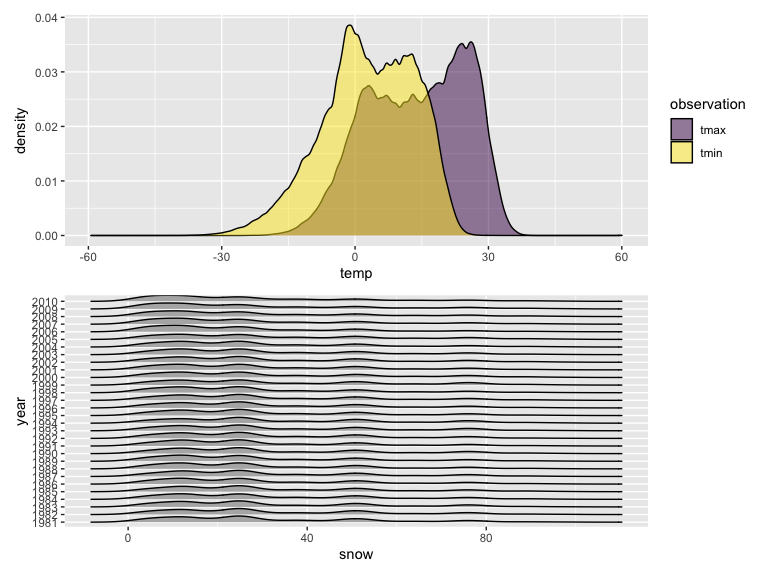

p8105_hw2_zz3039.Rmd
================
2022-10-12

``` r
library(tidyverse)
library(readr)
library(p8105.datasets)
library(ggridges)
library(patchwork)

knitr::opts_chunk$set(
    echo = TRUE,
    warning = FALSE,
    fig.width = 8, 
  fig.height = 6,
  out.width = "90%")

options(
  ggplot2.continuous.colour = "viridis",
  ggplot2.continuous.fill = "viridis")
```

## Problem 1

``` r
data("instacart")

instacart = 
  instacart %>% 
  as_tibble(instacart)
```

This dataset contains 1384617 rows and 15 columns, with each row
resprenting a single product from an instacart order. Variables include
identifiers for user, order, and product; the order in which each
product was added to the cart. There are several order-level variables,
describing the day and time of the order, and number of days since prior
order. Then there are several item-specific variables, describing the
product name (e.g. Yogurt, Avocado), department (e.g. dairy and eggs,
produce), and aisle (e.g. yogurt, fresh fruits), and whether the item
has been ordered by this user in the past. In total, there are 39123
products found in 131209 orders from 131209 distinct users.

Below is a table summarizing the number of items ordered from aisle. In
total, there are 134 aisles, with fresh vegetables and fresh fruits
holding the most items ordered by far.

``` r
instacart %>% 
  count(aisle) %>% 
  arrange(desc(n))
```

    ## # A tibble: 134 × 2
    ##    aisle                              n
    ##    <chr>                          <int>
    ##  1 fresh vegetables              150609
    ##  2 fresh fruits                  150473
    ##  3 packaged vegetables fruits     78493
    ##  4 yogurt                         55240
    ##  5 packaged cheese                41699
    ##  6 water seltzer sparkling water  36617
    ##  7 milk                           32644
    ##  8 chips pretzels                 31269
    ##  9 soy lactosefree                26240
    ## 10 bread                          23635
    ## # … with 124 more rows

Next is a plot that shows the number of items ordered in each aisle.
Here, aisles are ordered by ascending number of items.

``` r
instacart %>% 
  count(aisle) %>% 
  filter(n > 10000) %>% 
  mutate(aisle = fct_reorder(aisle, n)) %>% 
  ggplot(aes(x = aisle, y = n)) + 
  geom_point() + 
  labs(title = "Number of items ordered in each aisle") +
  theme(axis.text.x = element_text(angle = 60, hjust = 1))
```


Our next table shows the three most popular items in aisles
`baking ingredients`, `dog food care`, and `packaged vegetables fruits`,
and includes the number of times each item is ordered in your table.

``` r
instacart %>% 
  filter(aisle %in% c("baking ingredients", "dog food care", "packaged vegetables fruits")) %>%
  group_by(aisle) %>% 
  count(product_name) %>% 
  mutate(rank = min_rank(desc(n))) %>% 
  filter(rank < 4) %>% 
  arrange(desc(n)) %>%
  knitr::kable()
```

| aisle                      | product_name                                  |    n | rank |
|:---------------------------|:----------------------------------------------|-----:|-----:|
| packaged vegetables fruits | Organic Baby Spinach                          | 9784 |    1 |
| packaged vegetables fruits | Organic Raspberries                           | 5546 |    2 |
| packaged vegetables fruits | Organic Blueberries                           | 4966 |    3 |
| baking ingredients         | Light Brown Sugar                             |  499 |    1 |
| baking ingredients         | Pure Baking Soda                              |  387 |    2 |
| baking ingredients         | Cane Sugar                                    |  336 |    3 |
| dog food care              | Snack Sticks Chicken & Rice Recipe Dog Treats |   30 |    1 |
| dog food care              | Organix Chicken & Brown Rice Recipe           |   28 |    2 |
| dog food care              | Small Dog Biscuits                            |   26 |    3 |

Finally is a table showing the mean hour of the day at which Pink Lady
Apples and Coffee Ice Cream are ordered on each day of the week. This
table has been formatted in an untidy manner for human readers. Pink
Lady Apples are generally purchased slightly earlier in the day than
Coffee Ice Cream, with the exception of day 5.

``` r
instacart %>%
  filter(product_name %in% c("Pink Lady Apples", "Coffee Ice Cream")) %>%
  group_by(product_name, order_dow) %>%
  summarize(mean_hour = mean(order_hour_of_day)) %>%
  spread(key = order_dow, value = mean_hour) %>%
  knitr::kable(digits = 2)
```

    ## `summarise()` has grouped output by 'product_name'. You can override using the
    ## `.groups` argument.

| product_name     |     0 |     1 |     2 |     3 |     4 |     5 |     6 |
|:-----------------|------:|------:|------:|------:|------:|------:|------:|
| Coffee Ice Cream | 13.77 | 14.32 | 15.38 | 15.32 | 15.22 | 12.26 | 13.83 |
| Pink Lady Apples | 13.44 | 11.36 | 11.70 | 14.25 | 11.55 | 12.78 | 11.94 |

## Problem 2

``` r
accel_data = read_csv("./data/accel_data.csv") %>% 
  janitor::clean_names() %>% 
  mutate(
    day_type = 
      case_when(
        day %in% c("Saturday", "Sunday") ~ "weekend",
        TRUE ~ "weekday"),
    accel_day = 
      rowSums(.[4:1443]),
    day = 
      forcats::fct_relevel(day, c("Monday", "Tuesday", "Wednesday", "Thursday", "Friday", "Saturday", "Sunday")),
    day_type = 
      forcats::fct_relevel(day_type, c("weekday", "weekend"))) %>%
  arrange(week, day_id, day, day_type, accel_day) %>% 
  select(week, day_id, day, day_type, accel_day, everything())

accel_data_tidy = 
  accel_data %>% 
  pivot_longer(
    activity_1:activity_1440,
    names_to = "time_min",
    names_prefix = "activity_",
    values_to = "accel_minute"
  ) %>% 
  select(week, day_id, day, day_type, time_min, accel_minute, accel_day)
```

This dataset has **7** variables, including **week, day_id, day,
day_type, time_min, accel_minute, accel_day**, and total **50400**
observations.

``` r
accel_data_day =
  accel_data %>% 
  select(week, day_id, day, day_type, accel_day) 
print(accel_data_day, n = 20)
```

    ## # A tibble: 35 × 5
    ##     week day_id day       day_type accel_day
    ##    <dbl>  <dbl> <fct>     <fct>        <dbl>
    ##  1     1      1 Friday    weekday    480543.
    ##  2     1      2 Monday    weekday     78828.
    ##  3     1      3 Saturday  weekend    376254 
    ##  4     1      4 Sunday    weekend    631105 
    ##  5     1      5 Thursday  weekday    355924.
    ##  6     1      6 Tuesday   weekday    307094.
    ##  7     1      7 Wednesday weekday    340115.
    ##  8     2      8 Friday    weekday    568839 
    ##  9     2      9 Monday    weekday    295431 
    ## 10     2     10 Saturday  weekend    607175 
    ## 11     2     11 Sunday    weekend    422018 
    ## 12     2     12 Thursday  weekday    474048 
    ## 13     2     13 Tuesday   weekday    423245 
    ## 14     2     14 Wednesday weekday    440962 
    ## 15     3     15 Friday    weekday    467420 
    ## 16     3     16 Monday    weekday    685910 
    ## 17     3     17 Saturday  weekend    382928 
    ## 18     3     18 Sunday    weekend    467052 
    ## 19     3     19 Thursday  weekday    371230 
    ## 20     3     20 Tuesday   weekday    381507 
    ## # … with 15 more rows

Actually I can’t see any trends apparent here in the activity data for
each day.

``` r
hour_data = 
  accel_data %>% 
  mutate(
    hour_1 = rowSums(.[6:65]),
    hour_2 = rowSums(.[66:125]),
    hour_3 = rowSums(.[126:185]),
    hour_4 = rowSums(.[186:245]),
    hour_5 = rowSums(.[246:305]),
    hour_6 = rowSums(.[306:365]),
    hour_7 = rowSums(.[366:425]),
    hour_8 = rowSums(.[426:485]),
    hour_9 = rowSums(.[486:545]),
    hour_10 = rowSums(.[546:605]),
    hour_11 = rowSums(.[606:665]),
    hour_12 = rowSums(.[666:725]),
    hour_13 = rowSums(.[726:785]),
    hour_14 = rowSums(.[786:845]),
    hour_15 = rowSums(.[846:905]),
    hour_16 = rowSums(.[906:965]),
    hour_17 = rowSums(.[966:1025]),
    hour_18 = rowSums(.[1026:1085]),
    hour_19 = rowSums(.[1086:1145]),
    hour_20 = rowSums(.[1146:1205]),
    hour_21 = rowSums(.[1206:1265]),
    hour_22 = rowSums(.[1266:1325]),
    hour_23 = rowSums(.[1326:1385]),
    hour_24 = rowSums(.[1386:1445])
  ) %>% 
  pivot_longer(
    hour_1:hour_24,
    names_to = "hour",
    names_prefix = "hour_",
    values_to = "accel_hour",
    ) %>% 
  mutate(
    hour = as.numeric(hour),
    day_id = as.character(day_id)) %>% 
  select(week, day_id, day, day_type, accel_day, hour, accel_hour)

plot_hour_data = 
  hour_data %>% 
  ggplot(aes(x = hour, y = accel_hour, fill = day_id, color = day)) +
  geom_line() +
  viridis::scale_color_viridis(
    name = "day", 
    discrete = TRUE) +
  labs(
    title = "Hourly plot of accelerometer data",
    x = "Hour of the day",
    y = "Accelerometer data") +
  scale_x_continuous(
    breaks = c(0, 12, 24),
    labels = c("0", "12", "24"),
    limits = c(0, 24)) +
  theme(legend.position = "bottom")
plot_hour_data
```


From the graph we can tell that the accelerometer data was generally low
in the first 5 hours of the day, while having peaks during 5\~10 hours
and 20\~25 hours. The weekday or weekend pattern of accelerometer data
was not very clear but it can be seen that the peak in 20\~25 hours was
mostly caused by accelerometer data from weekdays, and the Sunday data
showed unusual peak during 10\~12.5 hours of the day.

## Problem 3

``` r
ny_noaa %>% 
  count(id, name = "n_obs_id")
```

    ## # A tibble: 747 × 2
    ##    id          n_obs_id
    ##    <chr>          <int>
    ##  1 US1NYAB0001     1157
    ##  2 US1NYAB0006      852
    ##  3 US1NYAB0010      822
    ##  4 US1NYAB0016      214
    ##  5 US1NYAB0017      459
    ##  6 US1NYAB0021      365
    ##  7 US1NYAB0022      273
    ##  8 US1NYAB0023      365
    ##  9 US1NYAB0025      215
    ## 10 US1NYAL0002      549
    ## # … with 737 more rows

``` r
ny_noaa %>% 
  count(date, name = "n_obs_date")
```

    ## # A tibble: 10,957 × 2
    ##    date       n_obs_date
    ##    <date>          <int>
    ##  1 1981-01-01        236
    ##  2 1981-01-02        236
    ##  3 1981-01-03        236
    ##  4 1981-01-04        236
    ##  5 1981-01-05        236
    ##  6 1981-01-06        236
    ##  7 1981-01-07        236
    ##  8 1981-01-08        236
    ##  9 1981-01-09        236
    ## 10 1981-01-10        236
    ## # … with 10,947 more rows

``` r
na_prcp = sum(is.na(ny_noaa$prcp)) / nrow(ny_noaa)
na_prcp
```

    ## [1] 0.0561958

``` r
na_snow = sum(is.na(ny_noaa$snow)) / nrow(ny_noaa)
na_snow
```

    ## [1] 0.146896

``` r
na_snwd = sum(is.na(ny_noaa$snwd)) / nrow(ny_noaa)
na_snwd
```

    ## [1] 0.2280331

``` r
na_tmax = sum(is.na(ny_noaa$tmax)) / nrow(ny_noaa)
na_tmax
```

    ## [1] 0.4371025

``` r
na_tmin = sum(is.na(ny_noaa$tmin)) / nrow(ny_noaa)
na_tmin
```

    ## [1] 0.4371264

The dataset **ny_noaa** has **7** variables, namely **id, date, prcp,
snow, snwd, tmax, tmin**, with **2595176** observations. The **“id”**
variable includes **747** specific id numbers, and the **“date”**
variable includes **10957** specific days.

The propotion of missing value in the variables **“prcp”, “snow”,
“snwd”, “tamx” and “tmin”** all exceeded **5%**, which should be paid
attention to.

``` r
noaa1 = 
  ny_noaa %>% 
  separate(date, into = c("year", "month", "day"), sep = "-") %>% 
  mutate(
    tmax = as.numeric(tmax)/10,
    tmin = as.numeric(tmin)/10,
    month = as.integer(month),
    month = month.abb[month],
    year = as.numeric(year))
snow_data = 
  noaa1 %>% 
  count(snow, name = "n_obs", sort = TRUE)
snow_data
```

    ## # A tibble: 282 × 2
    ##     snow   n_obs
    ##    <int>   <int>
    ##  1     0 2008508
    ##  2    NA  381221
    ##  3    25   31022
    ##  4    13   23095
    ##  5    51   18274
    ##  6    76   10173
    ##  7     8    9962
    ##  8     5    9748
    ##  9    38    9197
    ## 10     3    8790
    ## # … with 272 more rows

The 5 most commonly observed values in snowfall are: **0, 25, 13, 51,
76**, as can be seen from the tibble above, with null value excluded.

``` r
jj_data = 
  noaa1 %>% 
  filter(month == "Jan"|month == "Jul")
jj_data %>% 
  group_by(year, month, id) %>% 
  mutate(mean_tmax = mean(tmax, na.rm = TRUE)) %>% 
  ggplot(aes(x = year, y = mean_tmax, color = id)) + 
  geom_line() +
  facet_grid(~month) +
  labs(
    title = "Yearly plot of max temperature",
    x = "Year",
    y = "Average max temperature"
  ) +
  theme(legend.position = "none")
```


It can be seen from the graph that the average max temperature in
January and July in each station fluctuated stably across years, with
temperature in January centered approximately around 0 and July around
27. There were also outliers in each month, like the extreme low
temperature in July around 1982 and June around 1988.

``` r
tmax_data = 
  noaa1 %>%
  select(year, month, tmax, tmin) %>% 
  pivot_longer(
    tmax:tmin,
    names_to = "observation", 
    values_to = "temp") %>% 
  ggplot(aes(x = temp, fill = observation)) +
  geom_density(alpha = .5) +
  viridis::scale_fill_viridis(discrete = TRUE)

snow_data = 
  noaa1 %>% 
  filter(snow > 0 & snow < 100) %>%
  mutate(year = as.factor(year)) %>% 
  ggplot(aes(x = snow, y = year)) + 
  geom_density_ridges(scale = .85)

tmax_data/snow_data
```

    ## Picking joint bandwidth of 3.76



The first graph showed the density of tmin and tmax, as we can see, they
both followed a uniform-like distribution with the mean lower for tmin
and higher for tmax.

The second graph showed the density of snowfall for each year, we can
see that the heights were mostly within 0mm to 40mm.
